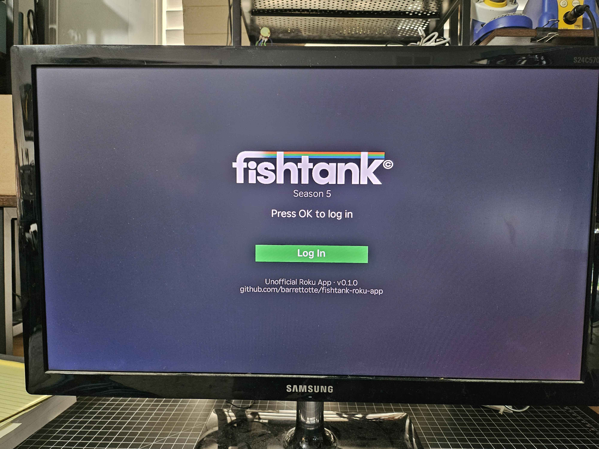
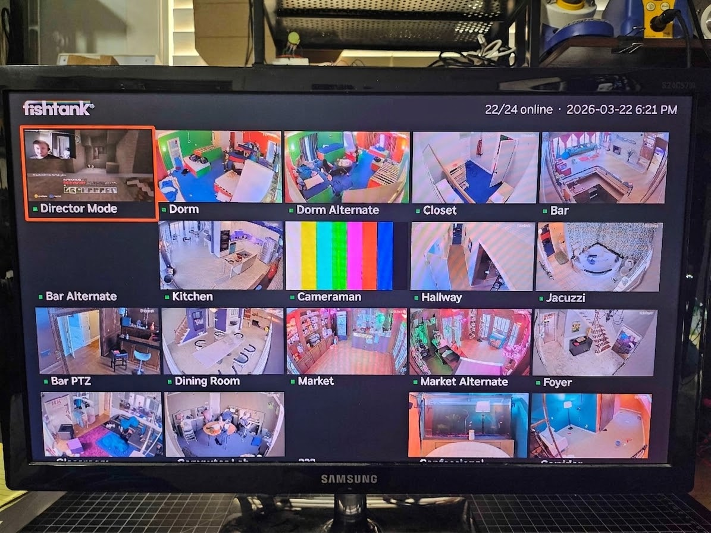
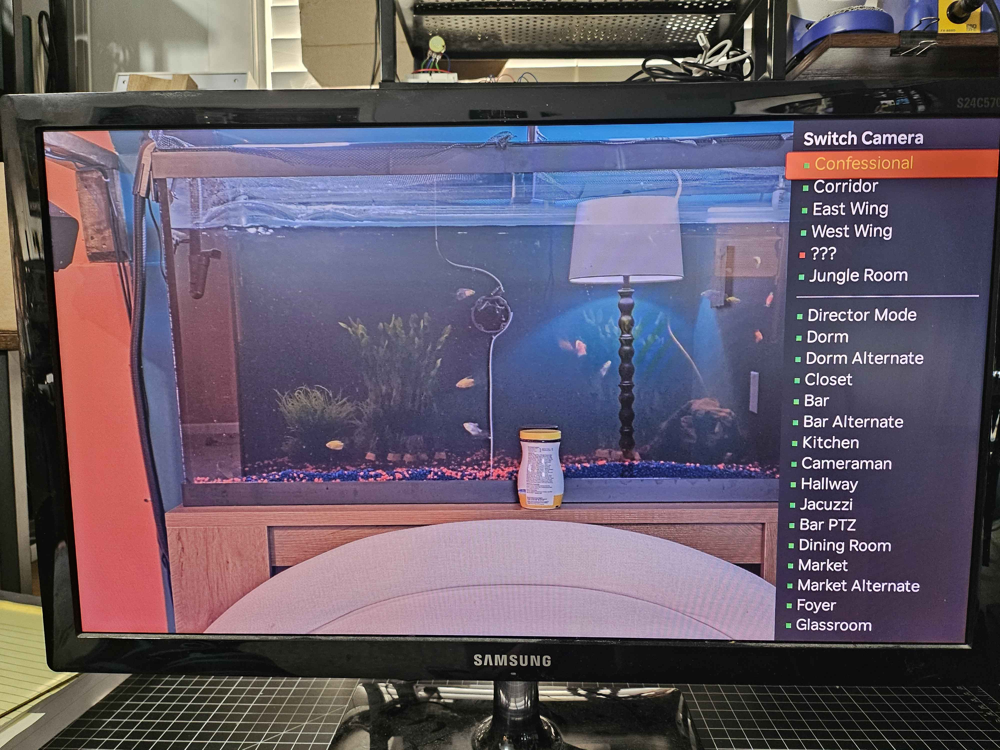
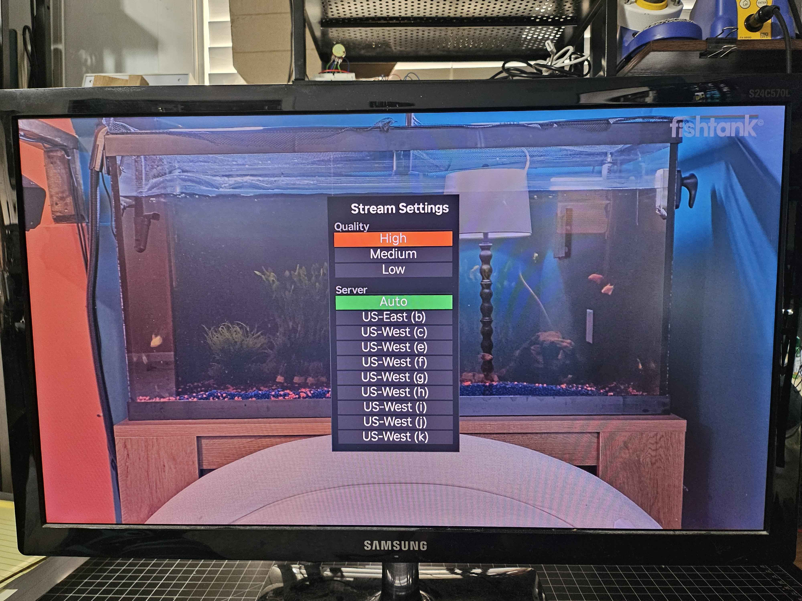
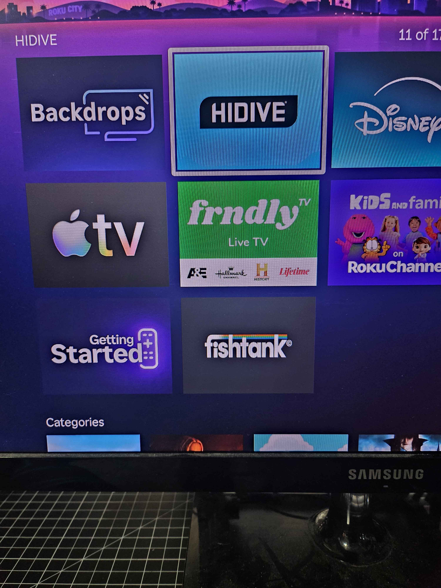

# fishtank-roku-app

A basic Roku app for watching Fishtank.live on Roku (unofficial).

Shoutout to [agathanon](https://github.com/agathanon) for making the first Fishtank Roku app repo (I think), I'm glad I wasn't the only one with the idea.
Check agathanon's repo/app https://github.com/agathanon/fishtank-roku first because my repo/app was made for learning, fun, and primarily for myself.

## Features

- Login with Fishtank.live email/password
- Auto-login with cached tokens on subsequent launches
- Camera grid with live thumbnails and online/offline indicators
- Full-screen HLS video playback
- Switch cameras without leaving the player (press Up)
- Stream quality selection: High / Medium / Low (press Down)
- Edge server override for outages (press Down)
- Quality and server preferences persist across sessions
- Automatic token refresh (every 25 min) with auto-retry on stream errors
- Manual token refresh via options menu








## Controls

### Camera Grid
| Button | Action |
|--------|--------|
| Arrow keys | Navigate cameras |
| OK | Open selected camera stream |
| * (Options) | Options menu (Refresh Token, Log Out) |

### Video Player
| Button | Action |
|--------|--------|
| OK | Show camera name, quality, and server info |
| Up | Open camera switcher |
| Down | Open stream settings (quality and server) |
| Back | Return to camera grid |

### Camera Switcher (in player)
| Button | Action |
|--------|--------|
| Up / Down | Navigate camera list |
| OK | Switch to selected camera |
| Back | Close switcher |

## Install (Sideload)

1. On your Roku remote, press: **Home Home Home Up Up Right Left Right Left Right** to enable Developer Mode
2. Note the IP address and set a password
3. Download the latest `fishtank-roku-app-vX.X.X.zip` from [Releases](https://github.com/barrettotte/fishtank-roku-app/releases)
4. Open `http://<your-roku-ip>` in a browser and log in with username `rokudev` and your password
5. Click **Upload**, select the zip, and click **Install**

> **Note:** This app is not available on the Roku Channel Store. It uses an unofficial, reverse-engineered API and is not affiliated with Fishtank.live. Sideloading is the only way to install it.

### Credential Storage

All sensitive data stored in the Roku registry is encrypted using [`roDeviceCrypto`](https://developer.roku.com/docs/references/brightscript/components/rodevicecrypto.md) with a channel-scoped hardware key. Only your app on your device can decrypt the data.

| Data | Encrypted | Purpose |
|------|-----------|---------|
| Email | Yes | Background re-login for token refresh |
| Password | Yes | Background re-login for token refresh |
| Access Token | Yes | REST API authentication |
| Live Stream Token | Yes | HLS stream URL JWT parameter |
| Display Name | No | Shown in header (non-sensitive) |
| Quality / Server | No | User preferences (non-sensitive) |

Credentials are stored to allow the app to re-login automatically in the background to refresh the stream token (JWT), which expires every 30 minutes.

> **Roku Channel Store note:** Roku's [certification criteria](https://developer.roku.com/docs/developer-program/certification/overview.md) prohibit storing customer personal information (including email/password) in the device registry, even encrypted. This app stores encrypted credentials purely for background token refresh and is intended for sideloading only. To comply with Roku certification, this would need to be replaced with a server-side token refresh proxy or prompting the user to re-login when the token expires.

## Developer Setup

### Prerequisites

- Node.js 18+
- A Roku device on the same network as your dev machine. I used a Model 3820R2 Streaming Stick 4K with 15.1 software version.

### Install

```bash
git clone https://github.com/barrettotte/fishtank-roku-app.git
cd fishtank-roku-app
npm install
cp .env.example .env
```

### Enable Developer Mode on your Roku

1. On your Roku remote, press: **Home Home Home Up Up Right Left Right Left Right**
2. Note the IP address shown on the Developer Settings screen
3. Enable the installer and set a password (the username is always `rokudev`)
4. Edit `.env` with your device IP and password:
   ```
   ROKU_DEV_TARGET=192.168.1.100
   ROKU_DEV_PASSWORD=password
   ```

### Build and Deploy

```sh
# Build and deploy
make deploy
```

This compiles the BrighterScript source and sideloads the app onto your Roku.

### Debugging

Connect to the BrightScript debug console via telnet:

```sh
make debug
```

All `print` statements in the code show up here.

### Regenerate App Icons and Splash Screens

Requires [ImageMagick](https://imagemagick.org/). Generates channel posters and splash screens from the logo:

```sh
magick -size 540x405 xc:'#191C20' \( src/images/logo-stripe.png -resize 360x \) -gravity center -composite src/images/channel-poster_fhd.png
magick -size 336x210 xc:'#191C20' \( src/images/logo-stripe.png -resize 220x \) -gravity center -composite src/images/channel-poster_hd.png
magick -size 1920x1080 xc:'#191C20' \( src/images/logo-stripe.png -resize 600x \) -gravity center -composite src/images/splash-screen_fhd.png
magick -size 1280x720 xc:'#191C20' \( src/images/logo-stripe.png -resize 400x \) -gravity center -composite src/images/splash-screen_hd.png
```

### Other Commands

```sh
make lint     # run bslint
make test     # run unit tests
make debug    # open telnet debug console
make clean    # delete build output
```

## References

- [BrightScript language reference](https://developer.roku.com/docs/references/brightscript/language/brightscript-language-reference.md)
- [Roku Developer Portal](https://developer.roku.com/)
- [BrighterScript](https://github.com/rokucommunity/brighterscript)
- [roku-deploy](https://github.com/rokucommunity/roku-deploy)
- [BrightScript VS Code extension](https://marketplace.visualstudio.com/items?itemName=RokuCommunity.brightscript)
